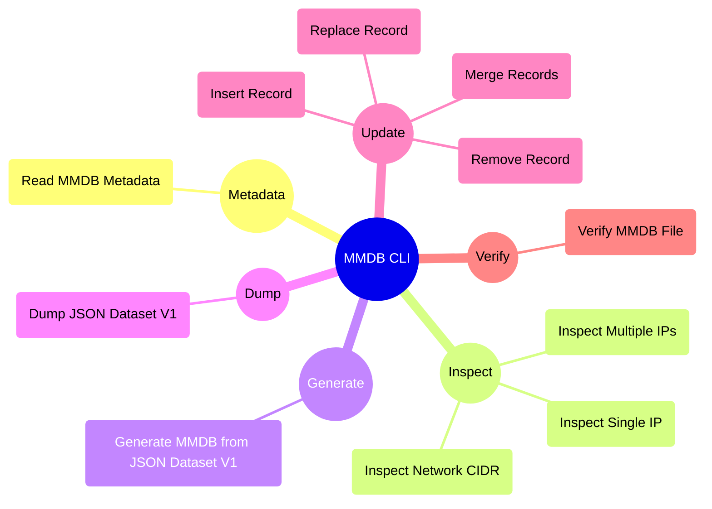

# Capabilities 🔥

MMDB CLI is a powerful command-line tool offering a wide range of features for working with MMDB files. Some of the key features include:

- **Generate MMDB**: You can generate MMDB files from JSON datasets using the `generate` command.
- **Dump MMDB**: You can dump MMDB files to JSON datasets using the `dump` command.
- **Check MMDB Metadata**: You can check the metadata of MMDB files using the `metadata` command.
- **Modify MMDB**: You can modify existing MMDB files by inserting, updating, or deleting records using the `update` command.
- **Inspect MMDB**: You can inspect MMDB files to view the metadata and data records using the `inspect` command.

<!---
  completion  Generate the autocompletion script for the specified shell
  dump        Dump MMDB data into a json dataset
  generate    Generate a MMDB database from a JSON dataset
  help        Help about any command
  inspect     Inspect an IP address or CIDR in the MMDB file
  metadata    Prints metadata of the MMDB file
  update      Update existing MMDB file
  version     Show version information for mmdb-cli

--->



## Commands

MMDB CLI provides the following commands to work with MMDB files:

```bash

InfraZ MMDB CLI is a command line toolkit for working with MMDB
Complete documentation is available at https://docs.infraz.io/mmdb-cli

Usage:
  mmdb-cli [command]

Available Commands:
  completion  Generate the autocompletion script for the specified shell
  dump        Dump MMDB data into a json dataset
  generate    Generate a MMDB database from a JSON dataset
  help        Help about any command
  inspect     Inspect an IP address or CIDR in the MMDB file
  metadata    Prints metadata of the MMDB file
  update      Update existing MMDB file
  verify      Verify the MMDB file
  version     Show version information for mmdb-cli

Flags:
  -h, --help   help for mmdb-cli

Use "mmdb-cli [command] --help" for more information about a command.
```

## Implement new features

If you have any feature requests or suggestions for **MMDB CLI**, we encourage you to create an issue on our [GitHub repository](https://github.com/InfraZ/mmdb-cli/issues). We are continuously seeking ways to enhance MMDB CLI and make it even more valuable for our users.
